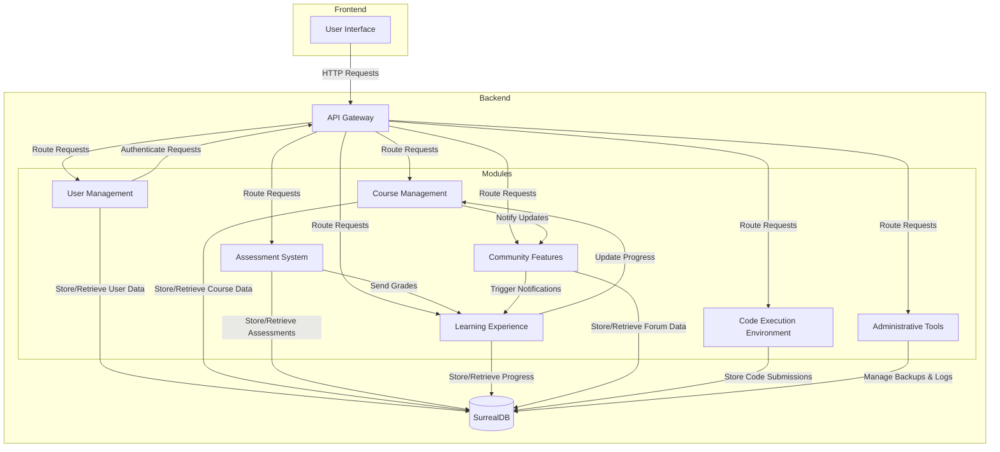
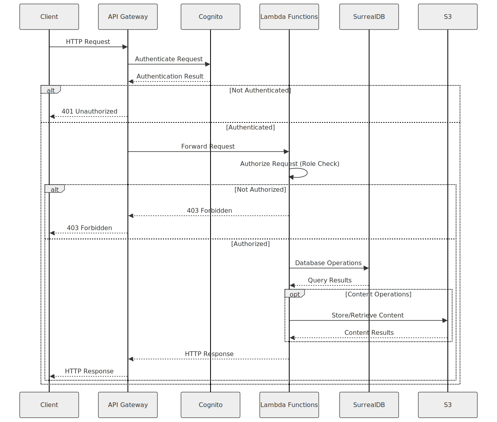
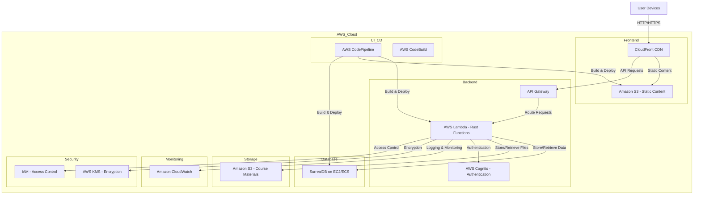

# Kaiju Academy

## 1. Introduction and Goals

### 1.1. Requirements Overview

#### What is Kaiju Academy?
Kaiju Academy is a **web-based e-learning platform** designed to make learning programming accessible and engaging. It combines modern Learning Management System (LMS) capabilities with interactive coding features, enabling users to learn at their own pace through structured courses, real-time feedback, and community collaboration. The platform supports students, educators, administrators, and moderators, offering tools for content creation, progress tracking, assessments, and secure user management.

#### Main Features
1. **User Management & Authentication**  
   - Role-based access control (Student, Educator, Admin, Moderator).  
   - Multi-factor authentication (MFA) and OAuth2 integration.  

2. **Course Creation & Management**  
   - Educators can create, update, and organize courses with modules, videos, PDFs, quizzes, and coding exercises.  
   - Dynamic content organization using sections and materials.  

3. **Interactive Learning Environment**  
   - Embedded code editor with real-time execution and automated grading.  
   - Personalized dashboards for tracking course progress and deadlines.  

4. **Assessment System**  
   - Automated grading for multiple-choice and coding questions.  
   - Manual grading workflows for short-answer questions.  

5. **Community Features**  
   - Discussion forums with threads, replies, and moderation tools.  
   - Notifications for course updates, deadlines, and forum interactions.  

6. **Administrative Tools**  
   - User analytics, system monitoring, and backup management.  
   - Compliance with GDPR, COPPA, and ISO/IEC 27001 standards.  

---

### 1.2. Quality Goals

| **Goal**               | **Description**                                                                                                      |
|-------------------------|----------------------------------------------------------------------------------------------------------------------|
| **Performance**         | - Response time <2 seconds for 95% of users.   - Code execution results in <5 seconds for 99% of submissions.    |
| **Scalability**         | - Support 10,000 concurrent users.   - Horizontal scaling via AWS Lambda and SurrealDB sharding.                  |
| **Reliability**         | - 99.9% uptime with automatic failover.   - Recovery from failures within 5 minutes.                              |
| **Security**            | - AES-256 encryption for data at rest.   - TLS 1.2+ for data in transit.   - Role-based permissions and MFA.   |
| **Usability**           | - Intuitive UI with 90% user satisfaction.   - Mobile-responsive design for screen sizes ≥320px.                  |
| **Maintainability**     | - Modular codebase with 80% test coverage.   - Infrastructure-as-Code (AWS CDK) for reproducible environments.     |
| **Compliance**          | - GDPR, COPPA, and accessibility law compliance.   - Daily encrypted backups stored for 30 days.                   |

---

### 1.3. Stakeholders

| **Stakeholder**         | **Role & Responsibilities**                                                                                         |
|-------------------------|----------------------------------------------------------------------------------------------------------------------|
| **Administrators**       | - Manage system health, user roles, and backups.   - Monitor performance and enforce security policies.            |
| **Students**            | - Enroll in courses, complete assessments, and track progress.   - Participate in forums and coding competitions. |
| **Educators**           | - Create and update course content.   - Grade submissions and provide feedback.                                   |
| **Content Moderators**  | - Moderate discussion forums.   - Enforce community guidelines and resolve disputes.                             |
| **Developers**          | - Implement and maintain backend services (Rust/AWS) and SurrealDB schema.   - Optimize performance and security. |
| **Legal & Compliance**  | - Ensure adherence to GDPR, COPPA, and other regulations.   - Manage data retention and privacy policies.         |

--- 

## 2. Architecture Constraints

### 2.1. Technical Constraints

1. **Hardware Constraints**  
   - The platform must run efficiently with low memory usage.  
   - Compatible with devices having a minimum of 4GB RAM.  

2. **Performance Constraints**  
   - Page load time must not exceed 3 seconds.  
   - Support for at least 1,000 concurrent users.  
   - Video streaming must adapt to user bandwidth.  
   - Code execution response time must be under 5 seconds.  
   - Database queries must complete within 1 second.  

3. **Operational Constraints**  
   - System uptime must be 99.9%.  
   - Automated backup systems must be implemented.  
   - Support for horizontal scaling.  
   - Monitoring and logging must be implemented.  
   - Disaster recovery procedures must be in place.  

4. **Dependencies**  
   - Third-party services: OAuth2 for authentication, PostgreSQL/MongoDB/Redis for databases, AWS/Google Cloud/DigitalOcean for cloud infrastructure, CDN for content delivery, and CodeMirror/Monaco for code editing.  
   - Development methodologies: UML modeling, COMET methodology, Docker/Kubernetes for container orchestration, and CI/CD pipelines.  

---

### 2.2. Organizational Constraints

1. **Resource Limitations**  
   - Limited development team size, requiring efficient use of resources.  
   - Budget constraints for cloud infrastructure and third-party services.  

2. **Time Constraints**  
   - Strict deadlines for project milestones and deliverables.  
   - Need for rapid development and deployment cycles.  

3. **Compliance Requirements**  
   - Adherence to GDPR, COPPA, and ISO/IEC 27001 standards.  
   - Regular security audits and penetration testing.  

4. **Stakeholder Expectations**  
   - High expectations for platform performance, usability, and scalability.  
   - Need for regular updates and feature enhancements based on user feedback.  

---

### 2.3. Conventions

1. **Coding Standards**  
   - Follow Rust's best practices for backend development.  
   - Use modular and reusable code structures.  
   - Maintain 80% test coverage for all modules.  

2. **Documentation Standards**  
   - Adhere to IEEE Std 830-1998 for software requirements specifications.  
   - Use Times New Roman, size 11 font for consistency.  
   - Highlight important terms in **bold** and supplementary notes in *italics*.  

3. **Version Control**  
   - Use Git for version control with a branching strategy (e.g., Git Flow).  
   - Commit messages must follow the Conventional Commits specification.  

4. **API Design**  
   - RESTful API design with clear and consistent endpoint naming.  
   - Use JSON for request/response payloads.  
   - Implement versioning for APIs to ensure backward compatibility.  

5. **Security Practices**  
   - Implement OAuth2 for authentication and role-based access control (RBAC).  
   - Encrypt sensitive data using AES-256.  
   - Use TLS 1.2+ for securing data in transit.  

6. **Deployment Practices**  
   - Use AWS CDK/CloudFormation for infrastructure-as-code.  
   - Implement CI/CD pipelines for automated testing and deployment.  
   - Use canary deployments to reduce risk during updates.  

---

## 3. System Scope and Context

### 3.1. Business Context

Kaiju Academy is designed to address the growing demand for accessible and engaging programming education. The platform targets a global audience, including students, educators, and institutions, aiming to provide a comprehensive learning experience through interactive courses, real-time feedback, and community collaboration. The business goals include:

1. **Expanding Digital Education Access**  
   - Provide affordable and scalable programming education to users worldwide.  
   - Offer courses for all skill levels, from beginners to advanced learners.  

2. **Enhancing Student Engagement**  
   - Use gamification elements to motivate learners.  
   - Provide instant feedback through automated grading and progress tracking.  

3. **Supporting Educators**  
   - Enable educators to create, manage, and update courses efficiently.  
   - Provide tools for grading, analytics, and student interaction.  

4. **Building a Skilled Workforce**  
   - Equip learners with in-demand programming skills.  
   - Foster collaboration through community features like discussion forums.  

5. **Monetization and Growth**  
   - Offer premium courses and certifications for revenue generation.  
   - Expand the platform’s reach through partnerships with educational institutions.  

---

### 3.2. Technical Context

Kaiju Academy is built on a modern, serverless architecture using **Rust** for backend development and **SurrealDB** as the primary database. The platform leverages **AWS** for cloud infrastructure, ensuring scalability, reliability, and cost efficiency. Key technical components include:

1. **Backend Architecture**  
   - **AWS Lambda**: Hosts Rust functions for API endpoints, enabling automatic scaling.  
   - **Amazon API Gateway**: Manages RESTful API interfaces and authentication.  
   - **AWS Cognito**: Handles user authentication and role-based access control.  
   - **SurrealDB**: Stores structured and unstructured data, supporting relational, document, and graph models.  

2. **Frontend Integration**  
   - Responsive web interface compatible with modern browsers (Chrome, Firefox, Safari, Edge).  
   - Mobile-friendly design for seamless access on smartphones and tablets.  
   - **Minimalist UI**: The frontend uses a clean and minimal design to ensure ease of use and focus on content.  

3. **Data Flow**  
   - Client requests are routed through API Gateway to Lambda functions.  
   - Lambda functions interact with SurrealDB for data retrieval and storage.  
   - Real-time updates (e.g., progress tracking, notifications) are handled via WebSocket connections.  

4. **Security Implementation**  
   - **Authentication**: OAuth2 and multi-factor authentication (MFA).  
   - **Data Encryption**: AES-256 for data at rest and TLS 1.2+ for data in transit.  
   - **Access Control**: Role-based permissions for students, educators, admins, and moderators.  

5. **Scalability and Performance**  
   - Horizontal scaling via AWS Lambda and SurrealDB sharding.  
   - Caching mechanisms (e.g., ElastiCache) for frequently accessed data.  
   - Content delivery via CDN for efficient media distribution.  

---

## 4. Solution Strategy

The solution strategy for Kaiju Academy focuses on delivering a scalable, secure, and user-friendly e-learning platform. The strategy is built on the following pillars:

1. **Modular Architecture**  
   - The system is designed with modular components (e.g., User Management, Course Management, Assessment System) to ensure flexibility and ease of maintenance.  
   - Each module is independently deployable and scalable, allowing for future enhancements without disrupting the entire system.

2. **Serverless Backend**  
   - The backend is built using **AWS Lambda** and **Rust**, ensuring high performance and cost efficiency.  
   - Serverless architecture allows automatic scaling to handle varying user loads, meeting the requirement of supporting 10,000 concurrent users.

3. **Real-Time Capabilities**  
   - Real-time features like progress tracking, notifications, and discussion forums are implemented using **WebSocket** connections and **SurrealDB**'s real-time capabilities.  
   - Ensures low latency (<200ms) for real-time interactions.

4. **Security and Compliance**  
   - The platform adheres to **GDPR**, **COPPA**, and **ISO/IEC 27001** standards.  
   - Implements **AES-256 encryption** for data at rest and **TLS 1.2+** for data in transit.  
   - Role-based access control (RBAC) ensures that users only access data and features relevant to their roles.

5. **Minimalist UI**  
   - The frontend uses a clean and minimal design to ensure ease of use and focus on content.  
   - Responsive design ensures compatibility with desktops, tablets, and mobile devices.

6. **Scalability and Performance**  
   - Horizontal scaling via **AWS Lambda** and **SurrealDB sharding**.  
   - Caching mechanisms (e.g., **ElastiCache**) for frequently accessed data.  
   - Content delivery via **CDN** for efficient media distribution.

---

## 5. Building Block View

The system is divided into several building blocks, each responsible for a specific functionality:

1. **User Management**  
   - Handles user registration, authentication, and role-based access control.  
   - Integrates with **AWS Cognito** for OAuth2 and multi-factor authentication (MFA).

2. **Course Management**  
   - Allows educators to create, update, and organize courses with modules, videos, PDFs, quizzes, and coding exercises.  
   - Uses **SurrealDB** to store course data and relationships.

3. **Assessment System**  
   - Provides tools for creating quizzes and assessments.  
   - Automatically grades multiple-choice and coding questions, while supporting manual grading for short-answer questions.

4. **Learning Experience**  
   - Tracks student progress through courses and modules.  
   - Provides personalized dashboards and AI-based learning recommendations.

5. **Community Features**  
   - Includes discussion forums with threads, replies, and moderation tools.  
   - Notifications for course updates, deadlines, and forum interactions.

6. **Code Execution Environment**  
   - A secure sandboxed environment for executing user code.  
   - Supports multiple programming languages and provides real-time feedback.

7. **Administrative Tools**  
   - Provides system monitoring, logging, and backup management.  
   - Ensures compliance with legal and regulatory requirements.

---

## 6. Runtime View

The runtime view describes how the system behaves during execution, focusing on key interactions between components. Below are two situational examples:

### **Situational Example 1: Student Enrolls in a Course**
1. **User Action**: A student logs in and navigates to the course catalog.  
2. **System Response**:  
   - The frontend sends a request to the **API Gateway**.  
   - The request is routed to the **Course Management Lambda function**, which retrieves the list of available courses from **SurrealDB**.  
   - The student selects a course and clicks "Enroll."  
   - The **Enrollment Lambda function** updates the student's enrollment status in **SurrealDB** and sends a confirmation notification via the **Notification Service**.  
3. **Real-Time Update**:  
   - The student's dashboard is updated in real-time to show the new enrollment.  
   - The educator is notified of the new enrollment via the **Notification Service**.

### **Situational Example 2: Educator Grades a Quiz**
1. **User Action**: An educator logs in and navigates to the grading section.  
2. **System Response**:  
   - The frontend sends a request to the **API Gateway**.  
   - The request is routed to the **Assessment System Lambda function**, which retrieves the quiz submissions from **SurrealDB**.  
   - The educator reviews the submissions and assigns grades.  
   - The **Grading Lambda function** updates the student's grades in **SurrealDB** and sends feedback via the **Notification Service**.  
3. **Real-Time Update**:  
   - The student receives a notification about the graded quiz.  
   - The student's progress tracker is updated in real-time to reflect the new grade.

---
## 7. Deployment View

The deployment view describes how the Kaiju Academy platform is deployed across various environments, including development, testing, and production. The system is designed to run on a **serverless architecture** using **AWS** services, ensuring scalability, reliability, and cost efficiency. Below is an overview of the deployment architecture:

### Key Components:
1. **Frontend**:  
   - Hosted on **Amazon S3** and delivered via **CloudFront CDN** for global accessibility and low-latency content delivery.  
   - The frontend is built with a **minimalist UI** and is compatible with modern web browsers (Chrome, Firefox, Safari, Edge).  

2. **Backend**:  
   - Built using **Rust** and deployed as **AWS Lambda** functions.  
   - **API Gateway** manages RESTful API endpoints, handles authentication, and routes requests to the appropriate Lambda functions.  
   - **AWS Cognito** handles user authentication, role-based access control, and multi-factor authentication (MFA).  

3. **Database**:  
   - **SurrealDB** is used as the primary database, deployed on **Amazon EC2/ECS** for scalability and performance.  
   - SurrealDB stores structured and unstructured data, including user profiles, course content, progress tracking, and forum discussions.  

4. **Storage**:  
   - **Amazon S3** is used for storing course materials (videos, PDFs, and other resources).  
   - Integrated with **CloudFront CDN** for efficient content delivery.  

5. **Monitoring and Logging**:  
   - **Amazon CloudWatch** is used for monitoring system health, logging, and alerting.  
   - Tracks metrics such as response times, error rates, and resource usage.  

6. **Security**:  
   - **AWS KMS** is used for encrypting data at rest (AES-256).  
   - **TLS 1.2+** is used for securing data in transit.  
   - **IAM policies** enforce role-based access control (RBAC) across all AWS services.  

7. **CI/CD Pipeline**:  
   - **AWS CodePipeline** and **CodeBuild** are used for continuous integration and deployment.  
   - Automated testing, security scanning, and canary deployments ensure smooth updates.  

---

## 8. Concepts

### 8.1. Domain Models
The domain model represents the various entities involved in the Kaiju Academy platform, including Users (Students, Educators, Administrators), Courses, Modules, Assessments, and Community Discussions. Each entity will have defined attributes and relationships to ensure a clear understanding of how they interact within the system.

### 8.2. Persistency
Data persistency will be managed using SurrealDB, which will store user profiles, course materials, progress tracking, and assessment results. The database will support ACID properties to ensure reliable transactions and data integrity.

### 8.3. User Interface
The user interface (UI) will be designed for ease of use, featuring a responsive layout that adapts to various devices. Key components include a dashboard for users to track their progress, course pages for content delivery, and interactive assessment interfaces. Accessibility will be prioritized to ensure it meets the needs of all users.

### 8.4. Session Handling
User sessions will be managed through secure authentication mechanisms using OAuth2. Session tokens will be issued upon login, with expiration policies in place to enhance security. Users will be able to maintain their session across multiple devices seamlessly.

### 8.5. Security
The platform will implement robust security measures, including encryption of sensitive data, role-based access control (RBAC), and two-factor authentication (2FA). Regular security audits and compliance with data protection regulations (GDPR, COPPA) will be enforced.

### 8.6. Transaction Processing
All transactions, including user registrations, course enrollments, and assessment submissions, will be processed using reliable transaction management to ensure data consistency. The system will utilize appropriate locking mechanisms to handle concurrent transactions effectively.

### 8.7. Safety
Safety measures will include sandboxed environments for code execution to prevent malicious activities. Regular backups will be performed to safeguard user data, ensuring recovery within 24 hours in case of data loss.

### 8.8. Communications and Integration
The platform will integrate with third-party services for authentication, notifications, and content delivery. RESTful APIs will facilitate communication between the frontend and backend services, ensuring smooth data exchange and functionality.

### 8.9. Plausibility and Validity Checks
Input validation will be enforced at both the client and server levels to ensure data integrity. This includes checks for required fields, format validation (e.g., email addresses), and logical consistency (e.g., course enrollment prerequisites).

### 8.10. Exception/Error Handling
A structured error handling mechanism will be implemented to capture and respond to exceptions gracefully. Users will receive informative error messages, and system logs will be maintained for troubleshooting and monitoring.

### 8.11. Logging
Comprehensive logging will be implemented for all user actions, system events, and error occurrences. Logs will be stored securely and monitored to identify potential issues and improve system performance.

### 8.12. Migration
Data migration strategies will be established for transitioning from legacy systems or initial data setups. Scripts and tools will be developed to facilitate smooth data transfer while ensuring data integrity and consistency.

### 8.13. Configurability
The platform will support configurability to allow for customization based on user roles and preferences. Administrators will have access to configuration settings to adjust system parameters, notifications, and user permissions as needed.

### 8.14. Internationalization
Kaiju Academy will support multiple languages to cater to a diverse user base. The application will be designed with internationalization in mind, allowing for easy localization of content and UI elements.

### 8.15. Testability
The system will be designed to facilitate automated testing, including unit tests, integration tests, and end-to-end tests. Test cases will be developed to cover critical functionalities and ensure system reliability.

### 8.16. Build-Management
A continuous integration and deployment (CI/CD) pipeline will be established to automate the build and deployment processes. This will ensure that code changes are tested and deployed efficiently, reducing the time to market and enhancing software quality.
## 9. Design Decisions

### 9.1. Why We Use SurrealDB

SurrealDB was selected as the primary database for Kaiju Academy based on its alignment with the platform’s functional and non-functional requirements:

1. **ACID Compliance**  
   - Ensures data integrity and transactional reliability for critical operations like course enrollment and grading.  

2. **Multi-Model Support**  
   - Accommodates diverse data types:  
     - **Relational**: Course-module relationships.  
     - **Document**: User profiles and nested course materials.  
     - **Graph**: Student-educator interactions in forums.  
   - Eliminates the need for multiple databases, simplifying architecture.  

3. **Real-Time Capabilities**  
   - Supports WebSocket-based real-time updates for progress tracking and forum notifications.  
   - Meets the latency requirement of <200ms for real-time features.  

4. **Scalability**  
   - Horizontal scaling via sharding aligns with the requirement to support 10,000 concurrent users.  
   - Read replicas and caching optimize performance for frequent queries like course listings.  

5. **Security**  
   - Row-level permissions enforce role-based access control (RBAC).  
   - TLS encryption for data in transit complies with GDPR and ISO/IEC 27001.  

6. **Simplified Development**  
   - SurrealQL combines SQL-like syntax with document/graph querying, reducing code complexity for nested course structures.  

---

### 9.2. Why We Use Rust

Rust was chosen for the backend implementation due to its unique advantages in safety, performance, and maintainability:

1. **Memory Safety**  
   - Ownership model prevents memory leaks and buffer overflows, critical for handling sensitive user data.  
   - Eliminates garbage collection overhead, ensuring predictable performance.  

2. **Concurrency Without Data Races**  
   - Borrow checker enforces thread safety, enabling efficient handling of 10,000+ concurrent users.  
   - Async/await simplifies asynchronous operations like API requests and real-time updates.  

3. **Performance**  
   - Zero-cost abstractions ensure high-speed execution for code submission grading (<5 seconds response time) and database queries (<1 second latency).  
   - Optimized resource usage reduces AWS Lambda costs.  

4. **Ecosystem and Tooling**  
   - Actix-Web and Axum frameworks streamline REST API development.  
   - Strong typing and error handling reduce runtime failures, aligning with reliability goals (99.9% uptime).  

5. **Long-Term Maintainability**  
   - Explicit code structure and compiler-driven refactoring ensure codebase stability.  
   - Modular design supports future features like AI-driven recommendations.  

6. **AWS Serverless Compatibility**  
   - Rust’s lightweight binaries minimize Lambda cold starts, meeting the 2-second page load requirement.  
   - Integrates seamlessly with AWS services like Cognito and CloudWatch.  

---

## 10. Quality Scenarios  
### 10.1. Quality Tree (Updated)  

```mermaid
graph TD
  A[Quality Attributes] --> B[Performance]
  A --> C[Safety]
  A --> D[Security]
  A --> E[Software Quality Attributes]
  A --> F[Additional Requirements]
  
  B --> B1[Response Time ≤2s]
  B --> B2[Scalability: 10k Users]
  B --> B3[Availability: 99.9% Uptime]
  B --> B4[Resource Efficiency ≤10MB/Session]
  
  C --> C1[User Safety: Code Sandbox]
  C --> C2[Data Safety: Daily Backups, GDPR]
  
  D --> D1[Auth: OAuth2/MFA]
  D --> D2[Authorization: RBAC]
  D --> D3[Data Protection: AES-256/TLS]
  D --> D4[Abuse Prevention]
  
  E --> E1[Usability: 90% Satisfaction]
  E --> E2[Reliability: 5min Recovery]
  E --> E3[Maintainability: 80% Test Coverage]
  E --> E4[Portability: Cross-Browser]
  E --> E5[Testability]
  
  E5 --> E5a[Coverage: ≥95% via JaCoCo]
  E5 --> E5b[Mockable External Services]
  
  F --> F1[ACID Compliance]
  F --> F2[Internationalization]
  F --> F3[Legal Compliance]
```

## 10.2. Evaluation Scenarios

### Scenario 1: Performance Under High Load  
**Description**:  
This scenario evaluates the system's ability to handle 10,000 concurrent users without performance degradation. The goal is to ensure that 95% of user requests are served within 2 seconds, even under peak load conditions.

**Steps**:  
1. **10k Concurrent Users**: Simulate 10,000 users accessing the platform simultaneously.  
2. **API Gateway Routes Requests**: Requests are routed through Amazon API Gateway to the appropriate backend services.  
3. **Lambda Scaling**: AWS Lambda automatically scales to handle the increased load, ensuring no single point of failure.  
4. **SurrealDB Read Replicas**: SurrealDB uses read replicas to distribute query load, optimizing response times.  
5. **95% ≤2s Response**: The system achieves the performance goal, with 95% of requests completing within 2 seconds.

**Key Metrics**:  
- **Response Time**: ≤2 seconds for 95% of requests.  
- **Scalability**: AWS Lambda and SurrealDB sharding ensure horizontal scaling.  
- **Availability**: 99.9% uptime maintained during peak load.

---

### Scenario 2: Testability  
**Description**:  
This scenario evaluates the system's testability, focusing on code coverage and the ability to mock external services for isolated testing. The goal is to ensure that the codebase is maintainable and reliable, with ≥95% test coverage and the ability to test components independently.

**Steps**:  
1. **Code Coverage**:  
   - **JaCoCo Integration**: JaCoCo is used to enforce ≥95% test coverage during CI/CD builds.  
   - **Unit Tests**: Unit tests validate core logic, such as parsing algorithms, without relying on external services.  

2. **Mockable Services**:  
   - **Decouple HTTP Fetching**: External dependencies (e.g., RSS feeds) are decoupled from parsing logic. For example, `FetchBikingPicturesJob` separates HTTP fetching (`DailyFratzeProvider`) from parsing.  
   - **Isolated Testing**: Mock `DailyFratzeProvider` to test parsing logic in isolation, ensuring tests pass without internet connectivity.  

**Key Metrics**:  
- **Test Coverage**: ≥95% enforced by JaCoCo.  
- **Mocking Capability**: External services are mockable, enabling isolated testing of core logic.  
- **Maintainability**: Modular design ensures easy updates and refactoring.

---

### Key Takeaways:  
1. **Performance**: The system meets the SRS requirement of supporting 10,000 concurrent users with ≤2s response times for 95% of requests.  
2. **Testability**: High test coverage (≥95%) and mockable external services ensure a maintainable and reliable codebase.  
3. **Alignment with Files**:  
   - **Database.pdf**: SurrealDB’s read replicas and indexing support high performance.  
   - **SRS**: Performance and testability requirements are directly addressed.  
   - **Backend.pdf**: AWS Lambda and Rust’s error handling ensure scalability and reliability.  

## 12. Glossary

This section defines key terms, acronyms, and abbreviations used throughout the Kaiju Academy documentation. It ensures clarity and consistency for all stakeholders, including developers, educators, and administrators.

| **Term**               | **Definition**                                                                                                      |
|-------------------------|----------------------------------------------------------------------------------------------------------------------|
| **ACID**               | A set of properties (Atomicity, Consistency, Isolation, Durability) that ensure reliable database transactions.      |
| **API**                | Application Programming Interface, a set of protocols and tools for building software applications.                   |
| **AWS**                | Amazon Web Services, a cloud computing platform used for hosting and scaling the Kaiju Academy platform.             |
| **CDN**                | Content Delivery Network, a system of distributed servers that deliver web content to users based on their location.  |
| **CI/CD**              | Continuous Integration and Continuous Deployment, a practice of automating the build, test, and deployment processes.|
| **COPPA**              | Children's Online Privacy Protection Act, a U.S. law regulating the collection of personal information from children.|
| **GDPR**               | General Data Protection Regulation, a European Union law governing data protection and privacy.                       |
| **IAM**                | Identity and Access Management, a framework for managing user identities and permissions in AWS.                     |
| **JaCoCo**             | A code coverage library for Java, used to enforce ≥95% test coverage in the Kaiju Academy platform.                  |
| **Lambda**             | AWS Lambda, a serverless computing service that runs code in response to events.                                     |
| **MFA**                | Multi-Factor Authentication, a security mechanism requiring multiple forms of verification for user access.          |
| **OAuth2**             | An authorization framework that allows third-party applications to access user data without exposing credentials.     |
| **RBAC**               | Role-Based Access Control, a method of restricting system access based on user roles.                                |
| **Rust**               | A systems programming language known for its memory safety and performance, used for the Kaiju Academy backend.      |
| **SurrealDB**          | A multi-model database used for storing structured and unstructured data in Kaiju Academy.                           |
| **TLS**                | Transport Layer Security, a cryptographic protocol for securing data in transit.                                     |
| **UML**                | Unified Modeling Language, a standardized modeling language used for visualizing system architecture.                |

---

